## Exercises. Basics of Kotlin programming language

Gleb Bulygin

DIN24S

---

### Exercise 1

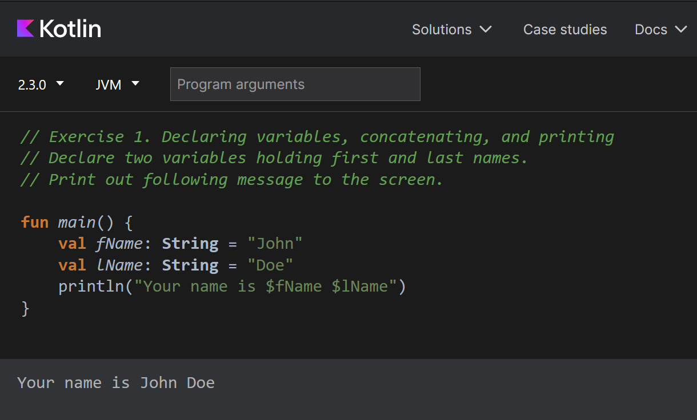
Figure 1. Exercise 1

---

### Exercise 2

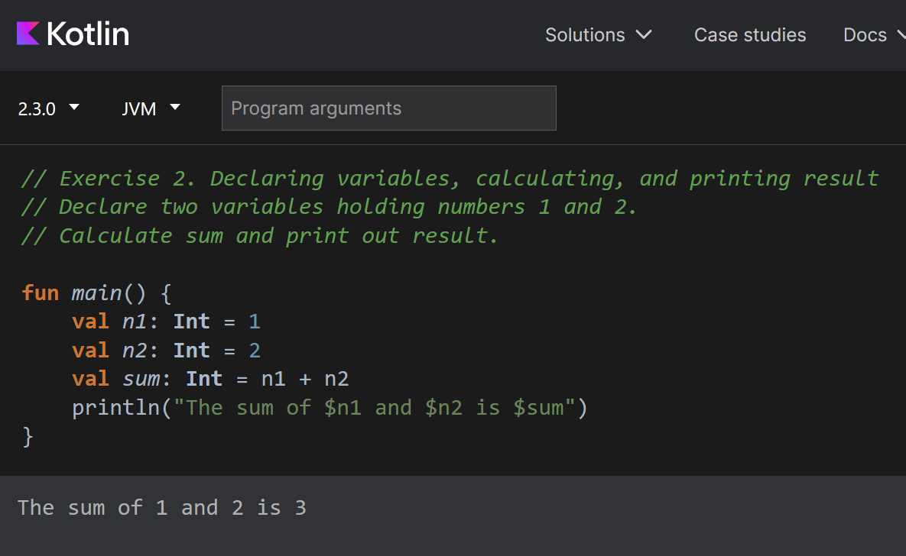
Figure 2. Exercise 2

---

### Exercise 3

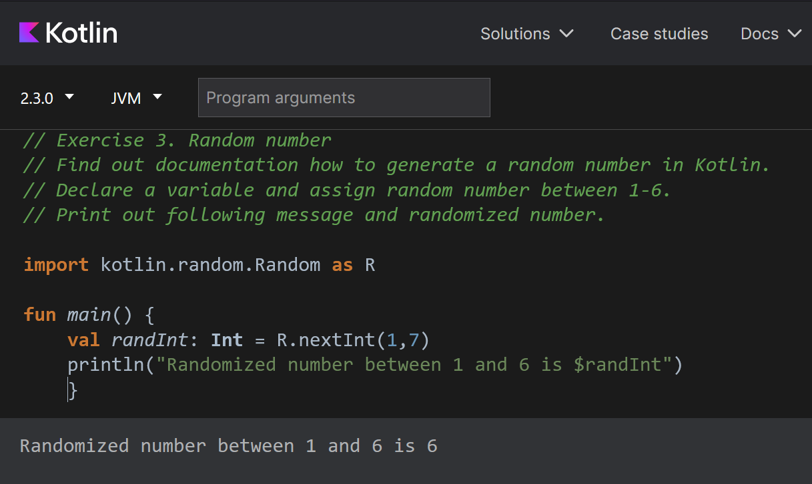
Figure 3. Exercise 3

---

### Exercise 4

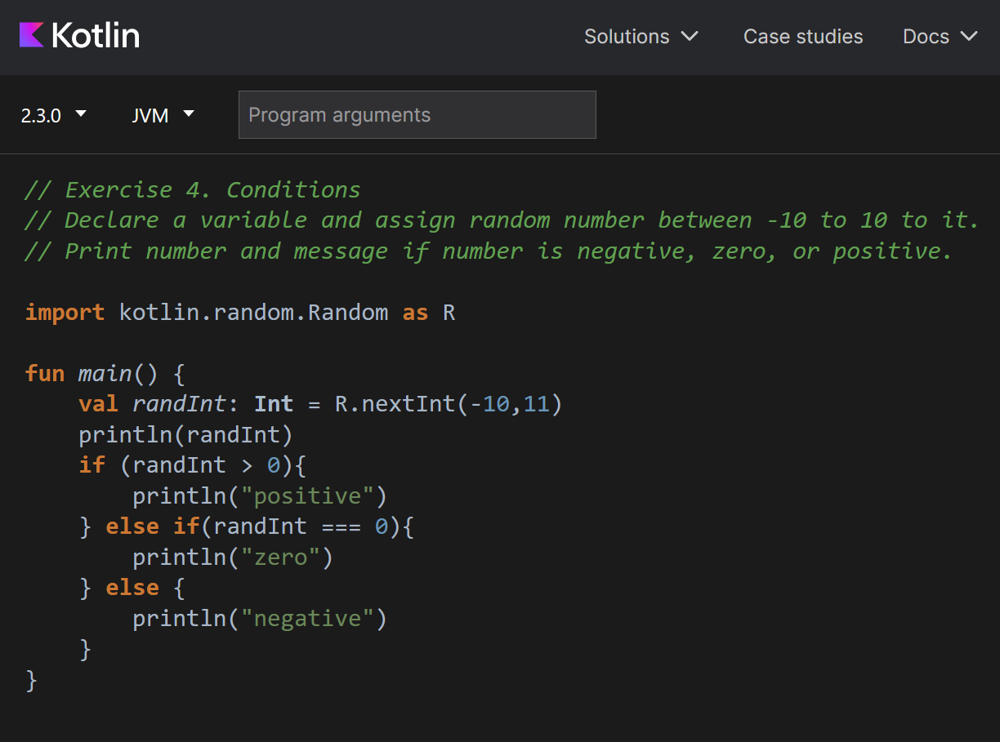
Figure 4. Exercise 4 - Code

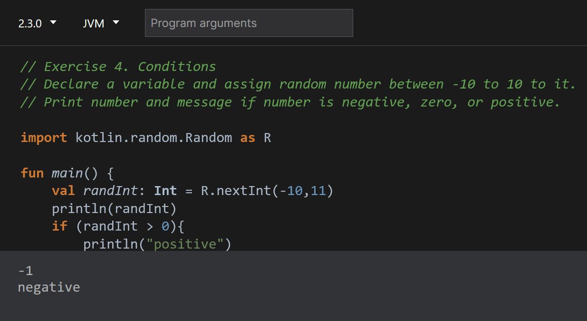
Figure 5. Exercise 4 - Negative

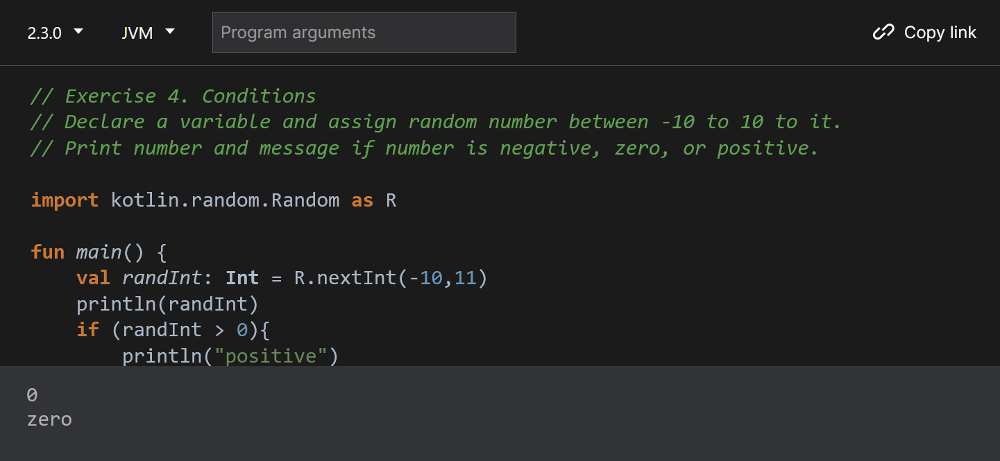
Figure 6. Exercise 4 - Zero

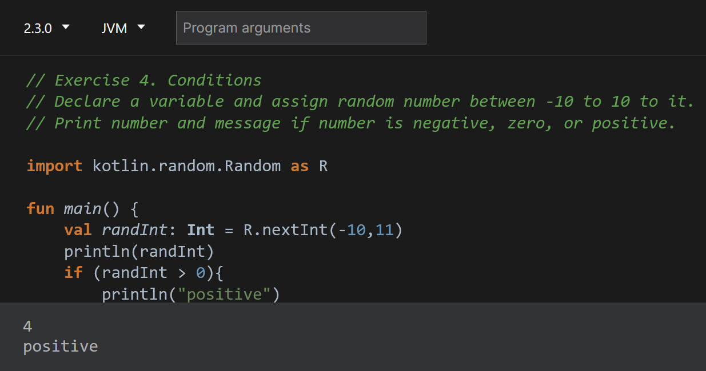
Figure 7. Exercise 4 - Positive

---

### Exercise 5

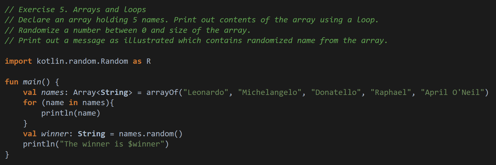
Figure 8. Exercise 5 - Code

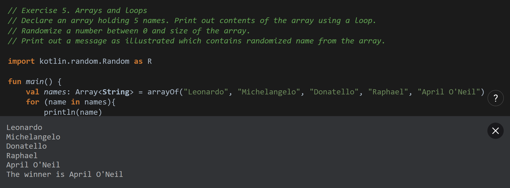
Figure 9. Exercise 5 - Result

---

### Exercise 6

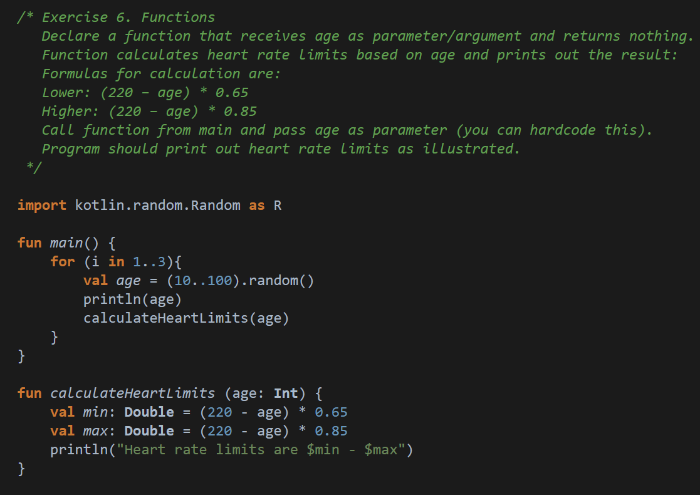
Figure 10. Exercise 6 - Code

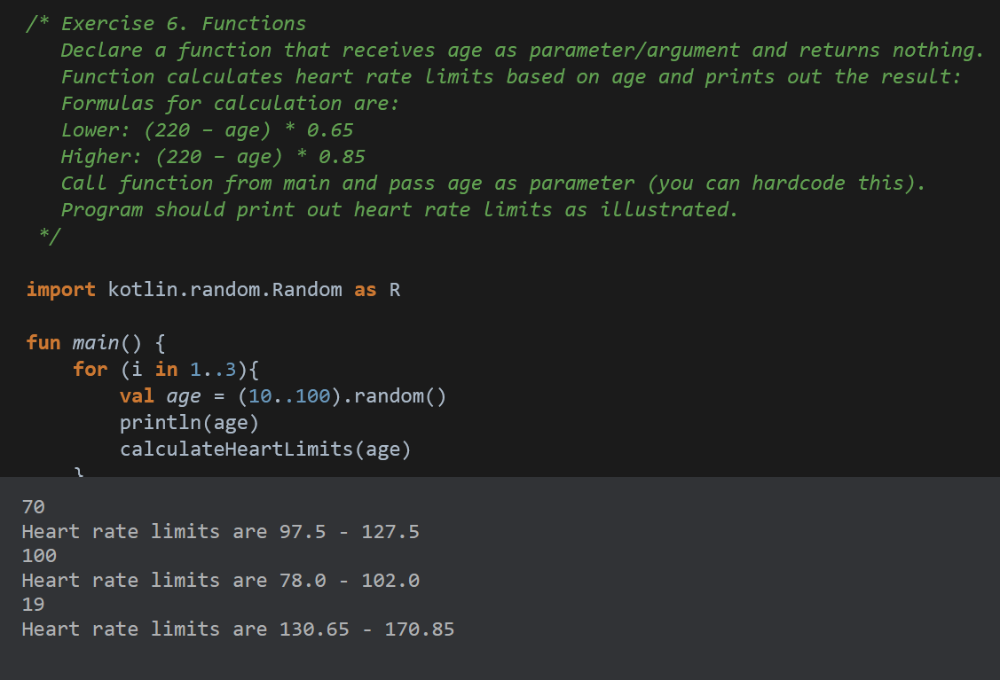
Figure 11. Exercise 6 - Result

---

### Exercise 6

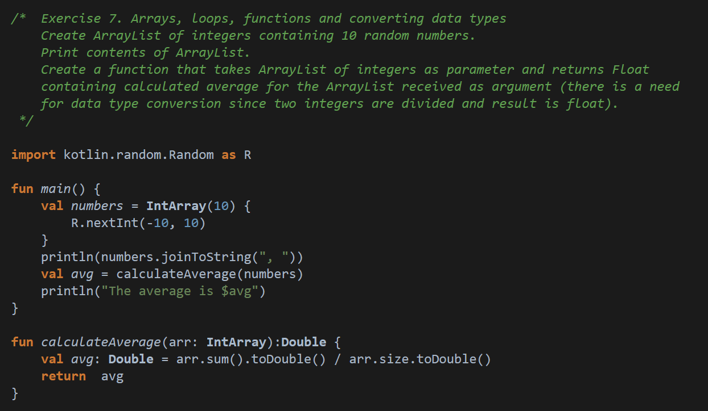
Figure 12. Exercise 7 - Code

Figure 13. Exercise 7 - Result

---
